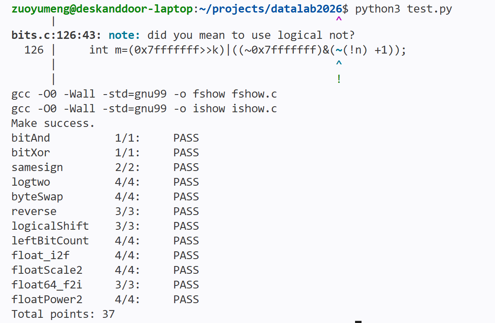

1.# datalab 报告

姓名：左雨萌

学号：2024200643

| 总分 | bitXor | logtwo | byteSwap | reverse | ... |
| --------- | ------------- | ------------- | ------------- | ----------------- |-----------|
| 37.00         | 1.00             | 4.00             | 4.00             | 3.00 |···  |


test 截图：


<!-- TODO: 用一个通过的截图，本地图片，放到 imgs 文件夹下，不要用这个 github，pandoc 解析可能有问题 -->

## 解题报告

### 亮点

<!-- 告诉助教哪些函数是你实现得最优秀的，比如你可以排序。不需要展开，展开请放到后文中。 -->

1. bitXor：使用~和&恰好满足七次操作
2. float_i2f：截断、舍入

### bitAnd
```c
return ~(~x|~y);
```
德摩根

### bitXor
```c
return ~(x&y)&~(~x&~y);
```

两个不都为0且两个都不为1即为所求。

### samesign

```c
if (!x) return !y;
if (!y) return 0;
return !((x >> 31) ^ (y >> 31));
```
1. 0正非负-先；2
2.


 3. 
1；34.4. 
1位；
异或为0-同符号；

### logtwo
```c
判断最高16位是否含1：若是，加16,v右移16位
对842位重复同一判断与缩减
由v>>1补上0或1位

各次右移的结果合并在一起合成答案。
```

### byteSwap
```c
    ns=n<<3;ms=m<<3;
    a=(x>>ns)&0xff;b=(x>>ms)&0xff;
    diff=a^b;
    return x^(diff<<ns)^(diff<<ms);1. 
```
diff在a、b不
2. 同的位置为1；原数在两个目标字节位置分别与这份差异异或，恰好将两处不同的位翻转，相3. 
同的位不动。
若 n=m，则 a=b、diff=0，返回原数。

### reverse
```c
re=0(unsigned)
重复 32 次：re = (re << 1) | (v & 1)；v >>= 1
返回 re1. 
```
re << 1 为新取得的位留出2. 
最低位；
| 将该位写入;
v >>= 1 后，原来的下3. 
3. 一位成为最低位。
重复 32 次，原第 0 位最早写入，之后又被左移 31 次，最终到第 31 位。

### logicalShift
```c
先求shifted=x>>n
构造mask：低(32-n)位为1，其余为0；n=0时32位全为1
返回shifted&mask
```
注意：会有warning，但是不影响编译

### leftBitCount
```c
int y = ~x;
n = n + (!(y >> 16) << 4);
n = n + (!(y >> (24 + ~n + 1)) << 3);
/* 后续按同一规则检查 4、2、1 位 */
return n +
1. 
 !y;
```
注意：x=-1 时
2.  32 位全为 1，故 y=0；分段判断最多把 n 加到 3
3. ，末尾 !y=1，最终得到 32。x=0 时 y 高位不为 0，返回 0。

### float_i2f
```c
若 x=0，返回全零编码；否则确定符号 s 和无符号幅值 m
找 m 的最高位 1 的位置 b；存储阶码 e=b+127
若 m 不超过 24 位，左移对齐；否则仅保留最高 24 位
比较丢弃部分与半个保留单位，决定是否进位
组合符号、阶码与 23 位尾数字段
```
注意：①阶码是b+12er7;
2.舍入得到偶数：超过一半就进位；恰好一半时，保留部分为奇数才进位。
3.负数的编码运算

### floatScale2
```c
e=255：原样返回（无穷大或 NaN）
e=0：保持符号，尾数左移一位
e=254：保持符号，返回无穷大
其余 e=1..253：保持符号和尾数，阶码加
1. 
一
```
规格化真2. 
实指数：e-127，乘2使；
非--，乘2尾数表示
阶码原本为255的NaN必须保留原有位模式

### float64_f2i
```c
从 uf2 取阶码 ex，计算真实指数 e=ex-1023
若 e<0，返回 0；若 e>=31，返回题定溢出编码
给尾数高段补上规格化数隐含的最高位 1
若 e<=20，右移高段；否则左移高段并接入 uf1 的相应高位
按符号返回正数或负数
```
补上隐含 1 后，高段共有 21 位。
①e<=20，整数部分全部在高段，右移；
②e>20，整数部分还需要uf1的若干高位，将两段拼接

### floatPower2
```c
if (x < -149) return 0;
if (x < -126) return 1u << (x + 149);
if (x > 127) return 0x7f800000u;
return (x + 127) << 23;
```
判断：
①非规格化
②规格化
③0
④无穷

注意：-126和-127的交界，阶码为1尾数为0->阶码为0尾数不为0；


## 反馈/收获/感悟/总结

<!-- 这一节，你可以简单描述你在这个 lab 上花费的时间/你认为的难度/你认为不合理的地方/你认为有趣的地方 -->

<!-- 或者是收获/感悟/总结 -->

<!-- 200 字以内，可以不写 -->

## 参考的重要资料

<!-- 有哪些文章/论文/PPT/课本对你的实现有重要启发或者帮助，或者是你直接引用了某个方法 -->

<!-- 请附上文章标题和可访问的网页路径 -->
